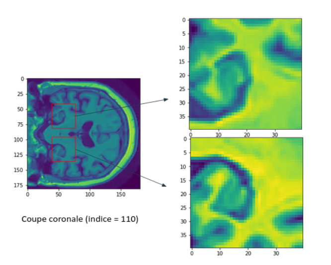

# Alzheimer dectection by 3D MRI analysis

- This machine Learning project aims to detect Alzheimer disease thanks to 3D MRI of human brain. To do so, our machine learning models were trained and tested on the ADNI dataset.

- Here is an overview of the different notebooks that implement different deep learning methods to solve the problem : 

- First with the use of the 2D epsilon method (2D CNN with 2D slices of the brain that represent a 3D object) : 

2D-epsilon_simple : Use of only 1 hippocampus (brain region involved in memory and alzheimer disease) to make a prediction  
2D-epsilon : Use of both hippocampus to generate several 2D slices (really close) and make a prediction   
2D-epsilon_esp=4 : Same code but with a larger value of epsilon (more distance between 2D slices)  

- Then with the use of 3D convolitional neural networks : 

Conv3D_whole_brain : 3D Convolutions on the whole brain to make the prediction  
Conv3D_hippocampus : 3D CNN focusing on the region of hippocampus  
Conv3D_hippo_reduced_nn : Same code with a reduced neural network  
Conv3D_hippo_data_augmentation : Same code with data augmentation (using 'flips' on the hippocampus)  
Conv3D_random_region : Same code but with another region than the hippocampus to observe its importante in Alzheimer disease  

  

2D slice of a 3D MRI image of the brain with the position of hippocampus 

- At best, we obtained a 88% accuracy on the binary classification between AD (Alzheimer disease) and CN (Cognitively Normal) patients. We also tried to predict other categories of development of the disease : pMCI (progressive mild cognitive impairment) that leads to more risks of reaching AD, and sMCI (stable mild cognitive impairment). By assuming the pMCI were closer to the AD patients and the sMCI closer to  the CN patients, we tried to predict the category of MCI patients with the models trained with AD and CN data. We finally obtained our best score with the 3D CNN on the hippocampus region with an accuracy of 70%.

- Contributors : 
Walid Kini, Yassine Mougou, Corentin Leger, Jacques Kafak 
